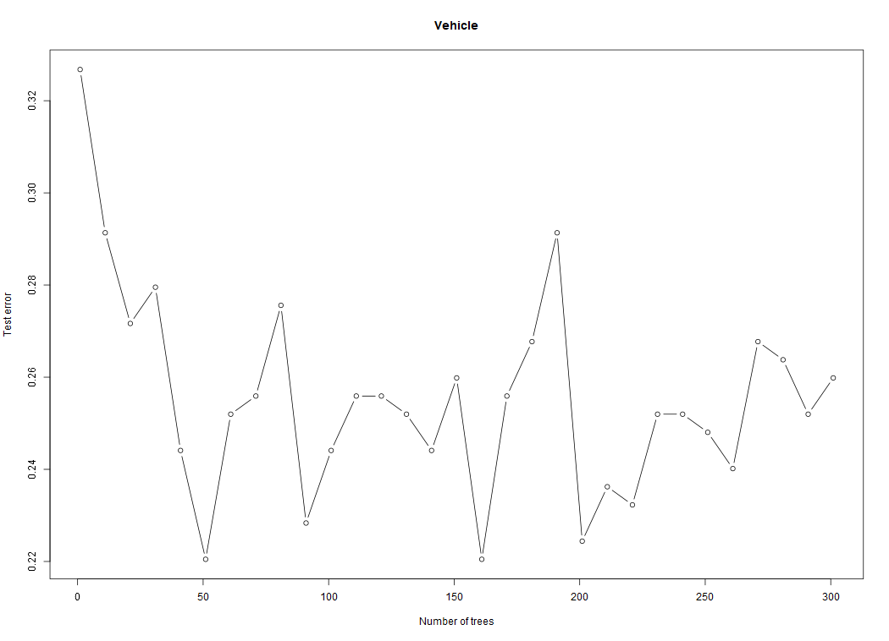
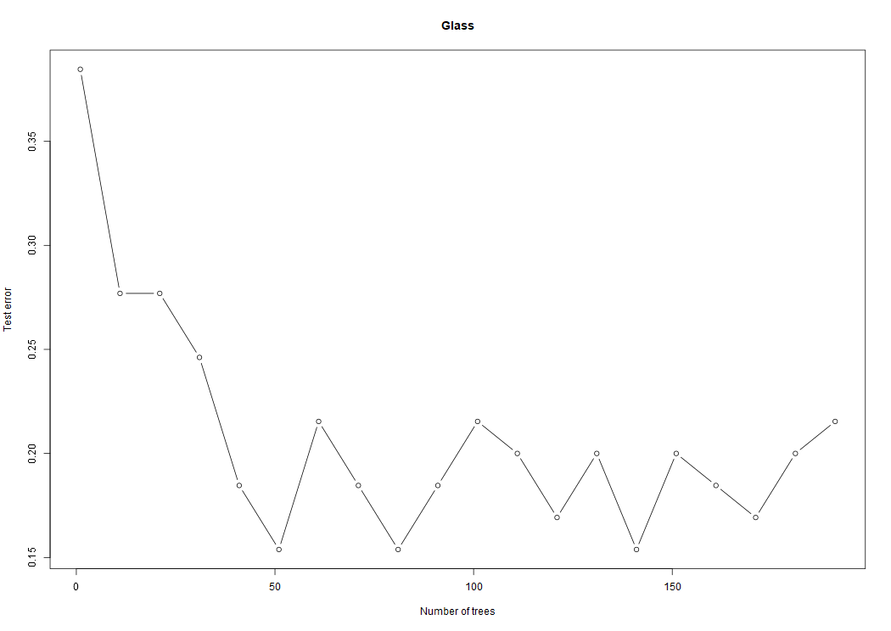

# boosting_lab
boosting_lab

## Work1


When n_tree grows to 50, the minimum error rate is basically obtained. At this time, with the growth of n_tree, the error rate is not decreasing but hovering around 0.24. I can see that as we increase the number of classifiers it doesn't necessarily decrease the error rate consistently, but it hovers around a limit, and if we add too many classifiers, the whole process takes longer The time, we need to balance the operation time and error rate to adjust n_tree.

## Work2


We can see that also in the Glass dataset, when n_tree grows to 50, we get the lowest error rate -0.15 or so. We can still get the conclusion of the previous experiment.

## Work3
For Vehicle I created a boosting model with 10 inner models and has followed error rate:
```
0.35826771653543305
0.3700787401574803
0.3543307086614173
0.3543307086614173
0.3543307086614173
0.3464566929133858
0.3464566929133858
0.3464566929133858
0.3464566929133858
0.3464566929133858
```

The weights increment is 2 which means for those not correctly identified dataset the weight will be 2 times in the next generated knn model.
I used correct_rate/sum(correct_rate) as the weight for each model. The weights of models are as followed:
```
[0.6417323  0.62992126 0.6456693  0.6456693  0.6456693  0.6535433
 0.6535433  0.6535433  0.6535433  0.6535433 ]
```

Then I use the whole boosting model for the testset and got the error rate:
```
Boosting model error rate:
0.3464566929133858
```

The did the same for the dataset Glass. There are 10 models for boosting in Glass. But the weights increment are set to 1.1 which means for those not correctly identified dataset the weight will be 1.1 times in the next generated knn model. 

The weights of models are as followed:
```
0.38461538461538464
0.36923076923076925
0.36923076923076925
0.36923076923076925
0.36923076923076925
0.36923076923076925
0.36923076923076925
0.36923076923076925
0.4
0.4
```

Weights of models:
```
[0.61538464 0.63076925 0.63076925 0.63076925 0.63076925 0.63076925
 0.63076925 0.63076925 0.6        0.6       ]
```

Error rate of the whole boosting knn model:
```
Boosting model error rate:
0.36923076923076925
```

Compared to the results got by 1 decision tree classifier, results of boosting knn still have higher error rate. But compared to single knn model, boosting knn does decrease the error rate for both of the models. But the weights increment is not a constant value for different datas. We should use different weights increment to test to get better results.
